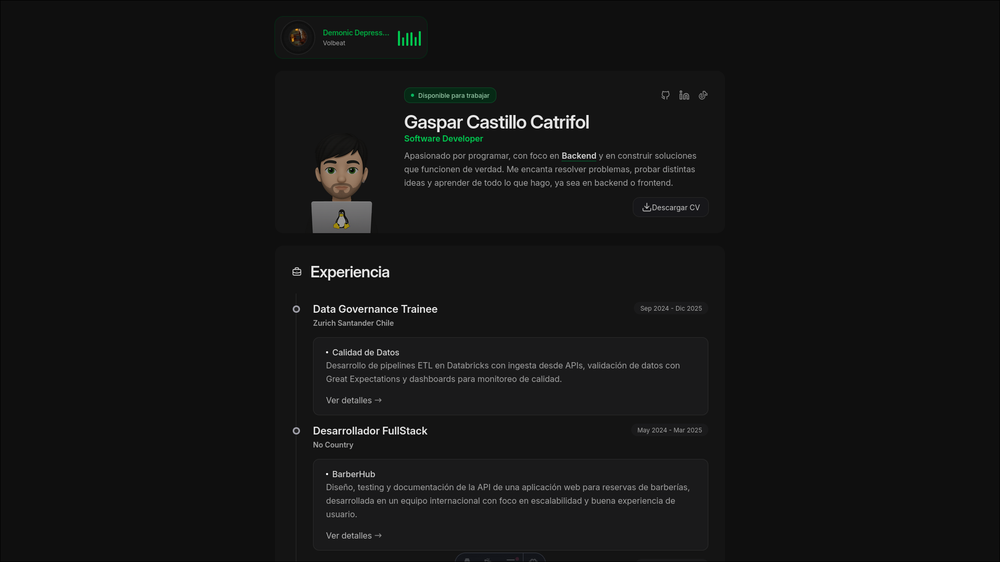

# 🌟 Portfolio Personal - Gaspar Castillo

> Portafolio desarrollado con [Astro](https://astro.build/), TailwindCSS y TypeScript.
> Organizado siguiendo un **Feature-Based Structure**, donde cada dominio funcional tiene su propia carpeta y los recursos compartidos están centralizados en `shared/`.

---

## 📸 Captura del Proyecto



---

## 🗂️ Estructura del Proyecto

```plaintext
src/
├── features/
│   ├── portfolio/
│   │   ├── components/
│   │   ├── types/
│   │   └── data/
│   ├── blog/
│   │   ├── components/
│   │   ├── types/
│   │   └── data/
│   └── media/
│       ├── components/
│       ├── types/
│       └── data/
├── shared/
│   ├── components/
│   ├── icons/
│   ├── types/
│   └── utils/
└── pages/
    ├── index.astro
    └── blog/
```

---

## 🛠 Tecnologías Utilizadas

- **[Astro](https://astro.build/)** – Framework frontend moderno  
- **[TypeScript](https://www.typescriptlang.org/)** – Tipado estático para JavaScript  
- **[TailwindCSS](https://tailwindcss.com/)** – Sistema de utilidades para estilos  
- **[PNPM](https://pnpm.io/)** – Gestor de paquetes rápido y eficiente  

---

## 🚀 Características Destacadas

- Estructura modular basada en **features**, facilitando escalabilidad y mantenibilidad.  
- Cada feature contiene sus **propios componentes, tipos y datos**, reduciendo dependencias cruzadas.  
- Recursos compartidos y utilidades en `shared/` para máxima reutilización.  
- Configuraciones globales y providers en `app/`.  
- Fácil integración de nuevos contenidos y páginas mediante Content Collections de Astro.  

---

## ⚡ Instalación y Uso

```bash
# Clonar repositorio
git clone https://github.com/isakiDev/astro-portfolio.git
cd astro-portfolio

# Instalar dependencias
pnpm install

# Ejecutar en modo desarrollo
pnpm dev

# Construir para producción
pnpm build
```